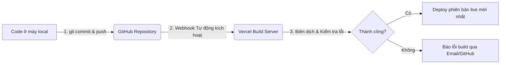

# Hướng dẫn Triển khai nhanh lên Vercel (CI/CD Tự động)

Tài liệu này hướng dẫn bạn cách liên kết repository GitHub [PersonnalHobbies](https://github.com/minhtuluc/PersonnalHobbies.git) với **Vercel** để tự động hóa quy trình triển khai (deploy). Sau khi thiết lập xong, mỗi lần bạn `git push` code mới lên GitHub, Vercel sẽ tự động cập nhật và chạy thử nghiệm phiên bản trực tuyến (live) của bạn.

---

## Các bước thiết lập ban đầu trên Vercel

### Bước 1: Đăng nhập Vercel
1.  Truy cập vào [Vercel.com](https://vercel.com).
2.  Chọn **Log In** và chọn đăng nhập bằng tài khoản **GitHub** của bạn (để Vercel có quyền truy cập các kho lưu trữ).

### Bước 2: Tạo dự án mới (Import Project)
1.  Tại giao diện Dashboard của Vercel, nhấn vào nút **Add New...** và chọn **Project**.
2.  Ở mục **Import Git Repository**, bạn sẽ thấy danh sách các repo của mình. 
3.  Tìm kiếm repository `PersonnalHobbies` và nhấn **Import**.
    *   *Lưu ý*: Nếu không tìm thấy, hãy nhấn vào liên kết cấu hình phân quyền của Vercel cho tài khoản GitHub của bạn để cho phép Vercel truy cập vào repo này.

### Bước 3: Cấu hình Dự án (Configure Project)
Vercel sẽ tự động nhận diện dự án của bạn là **Next.js** và thiết lập các thông số mặc định rất chuẩn xác:
*   **Framework Preset**: Chọn `Next.js` (Tự động phát hiện).
*   **Root Directory**: `./` (Thư mục gốc).
*   **Build and Output Settings**: Giữ nguyên mặc định:
    *   Build Command: `next build`
    *   Output Directory: `.next`
    *   Install Command: `npm install`
*   **Environment Variables**: Tạm thời bỏ trống (chúng ta chưa dùng các biến môi trường bảo mật). Sau này khi bạn tích hợp Database hay API Key của bên thứ 3 (như OpenAI, Supabase), bạn sẽ khai báo tại đây.

### Bước 4: Triển khai (Deploy)
1.  Nhấn nút **Deploy**.
2.  Quá trình biên dịch và khởi tạo môi trường sẽ diễn ra trong khoảng **1 - 2 phút**.
3.  Khi hoàn tất, bạn sẽ nhận được một thông báo chúc mừng kèm theo giao diện trực quan của website và các đường link truy cập dạng: `https://personnal-hobbies-xxxx.vercel.app`.

---

## Cách hoạt động của quy trình Commit & Test Live (CI/CD)

Khi dự án đã được liên kết thành công, quy trình phát triển của bạn sẽ cực kỳ tinh gọn:



### 1. Triển khai Production tự động (Automatic Production Deploy)
Mỗi lần bạn chỉnh sửa code và push lên nhánh mặc định (`main`):
```bash
git add .
git commit -m "feat: cập nhật giao diện hoặc viết bài blog mới"
git push origin main
```
Vercel sẽ tự động bắt lấy sự kiện push này, tự động chạy `npm run build` và cập nhật trang web live của bạn mà bạn không cần thao tác gì thêm trên trang chủ Vercel.

### 2. Triển khai Preview (Preview Deployments)
Nếu sau này bạn làm việc trên các nhánh phụ (ví dụ: `feature/game-ui`), khi bạn push nhánh phụ đó lên GitHub hoặc tạo một **Pull Request**:
*   Vercel sẽ build một bản thử nghiệm riêng (Preview URL) dành riêng cho nhánh đó.
*   Bạn có thể click vào link Preview để xem trước và test thử các tính năng mới chạy như thế nào trên môi trường thật mà không làm ảnh hưởng đến trang web chính đang hoạt động (Production).
*   Khi bạn gộp nhánh phụ vào `main` (Merge Pull Request), Vercel sẽ tự động cập nhật bản đó lên Production.
